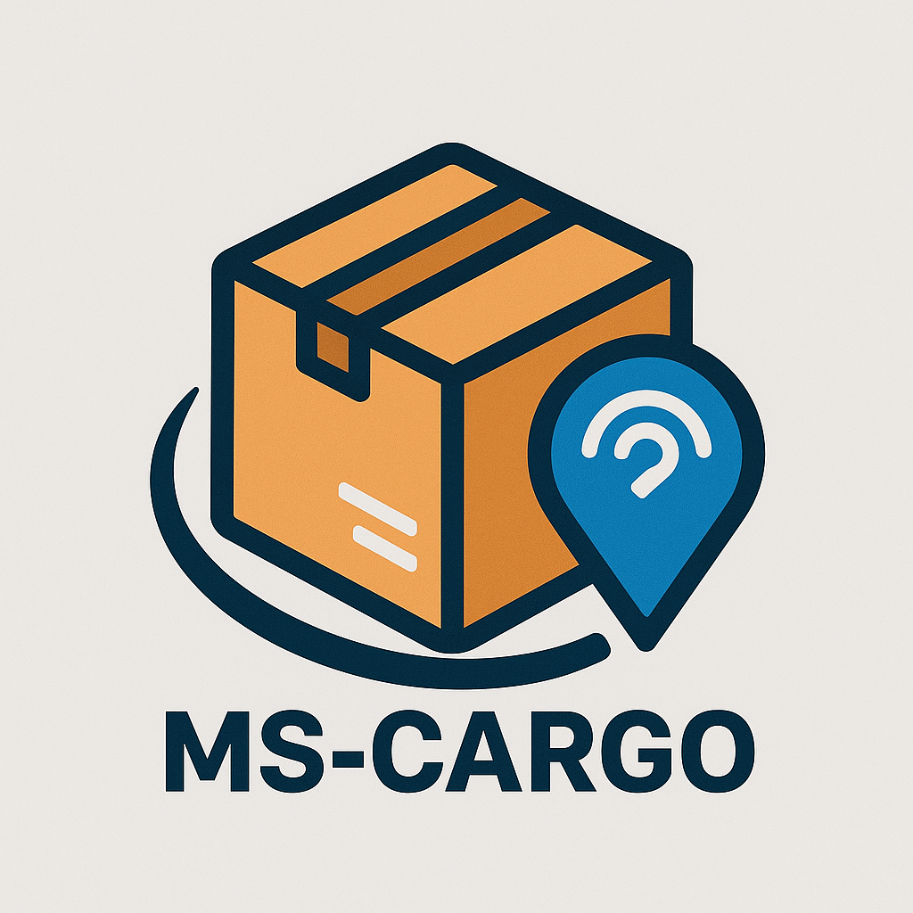

# MS-CARGO: Microservices-Based Cargo Tracking System



This is a comprehensive cargo tracking system built with a microservices architecture. The project demonstrates key concepts of modern software development, including containerization, inter-service communication (synchronous and asynchronous), database integration, and observability.

This project was developed as part of the Microservices course at Ege University.

## Features

- **User Authentication:** Secure user registration and login using JWT.
- **Hybrid Shipment Tracking:**
  - **Public Tracking:** Guests can track shipments with basic status information.
  - **Private Tracking:** Logged-in users can view full shipment details, including recipient information and tracking history.
- **Real-time Notifications:** (Simulated) Event-driven architecture using RabbitMQ for real-time status updates.
- **Observability:** Integrated monitoring stack with Prometheus for metrics collection and Grafana for data visualization.

## Architecture

The system is composed of several loosely coupled, independently deployable microservices:

- **Frontend:** A React-based single-page application providing the user interface.
- **API Gateway (NGINX):** A single entry point that routes all external traffic to the appropriate service.
- **User Service:** Manages user registration and login.
- **Auth Service:** Issues and validates JSON Web Tokens (JWTs).
- **Tracking Service:** Provides shipment data from a PostgreSQL database.
- **Update Service:** Publishes shipment status update events to the message queue.
- **Notification Service:** A worker that consumes events from the message queue to send notifications.
- **PostgreSQL:** The relational database for user and shipment data.
- **RabbitMQ:** The message broker for asynchronous communication.
- **Prometheus:** Collects performance metrics from all services.
- **Grafana:** Visualizes metrics from Prometheus in dashboards.

## Technology Stack

- **Backend:** Node.js (Express.js)
- **Frontend:** React.js
- **Databases:** PostgreSQL
- **Messaging:** RabbitMQ
- **Containerization:** Docker, Docker Compose
- **API Gateway:** NGINX
- **Monitoring:** Prometheus, Grafana

## Getting Started

### Prerequisites

- [Docker](https://www.docker.com/products/docker-desktop/) and [Docker Compose](https://docs.docker.com/compose/install/) must be installed on your system.

### Installation & Running the Project

1.  **Clone the repository:**
    ```bash
    git clone [your-repository-url]
    cd cargo-tracking-project
    ```

2.  **Build and run the containers:**
    This command will build all the service images and start the entire application stack in the background.
    ```bash
    docker-compose up -d --build
    ```
    The initial build may take a few minutes.

3.  **Access the application:**
    - **Frontend Application:** Open your web browser and navigate to `http://localhost:8888`
    - **Grafana Dashboard:** `http://localhost:3000` (Login: admin / admin)
    - **Prometheus UI:** `http://localhost:9090`
    - **RabbitMQ Management:** `http://localhost:15672` (Login: guest / guest)

### Stopping the Application

To stop all running containers, run the following command in the project's root directory:
```bash
docker-compose down

To also remove the data volumes (e.g., to reset the database), use:

docker-compose down --volumes

Test Scenarios
The system is pre-seeded with two test shipments to demonstrate the hybrid tracking functionality. To test all scenarios, you will need to register two users.

Pre-seeded Shipments:

USER123: This shipment is private and belongs to the first user registered in the system (who will have user_id=1).
PUBLIC123: This shipment is public, and its full details can be viewed by any logged-in user.
Setup: Register Test Users
Navigate to the application at http://localhost:8888.
Click the profile icon (👤) to open the login/register modal.
Register User 1 (The Owner):
Email: user1@test.com
Password: any_password
Register User 2 (Another User):
Email: user2@test.com
Password: any_password
Scenario 1: Guest User (Not Logged In)
Action: Track USER123 and PUBLIC123.
Expected Result: For both shipments, only basic details (Status, Current Location) will be displayed. No sensitive information or tracking history is shown.
Scenario 2: Unauthorized User (Logged in as user2@test.com)
Action 1: Track PUBLIC123.
Expected Result 1: Since this shipment is public, all details including recipient info and tracking history will be displayed.
Action 2: Track USER123.
Expected Result 2: Since this shipment does not belong to user2, the system will only display basic details to protect privacy.
Scenario 3: Authorized User (Logged in as user1@test.com)
Action: Track USER123.
Expected Result: As the owner of the shipment, you will see all details: recipient name, address, and the full tracking history.